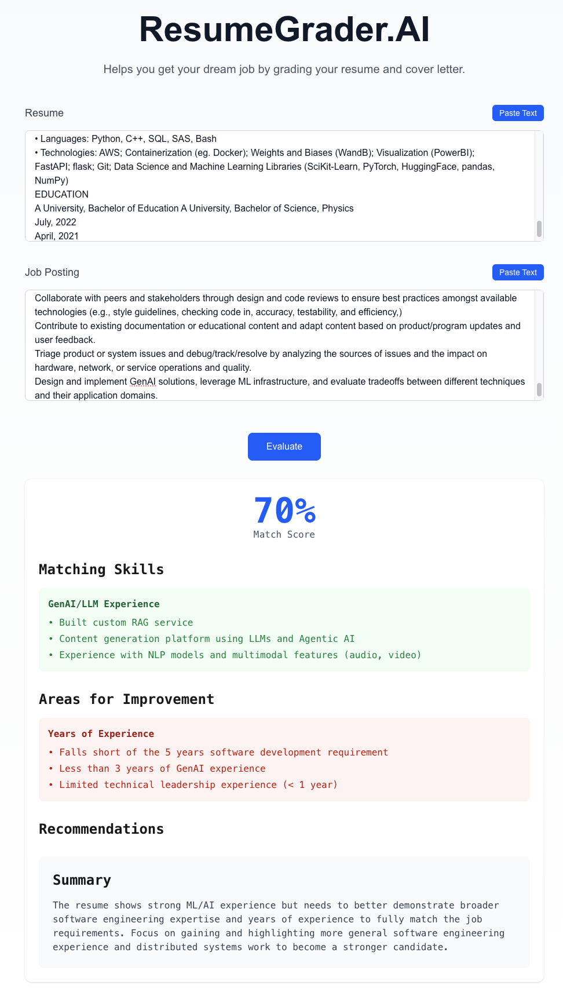

# ResumeGrader.AI 📝

ResumeGrader.AI is an intelligent resume analysis tool that helps job seekers optimize their resumes for specific job postings. Using Claude's advanced AI capabilities, it provides detailed feedback, matching scores, and actionable recommendations.




## Features ✨

- **Instant Resume Analysis**: Get immediate feedback on how well your resume matches a job posting
- **Smart Matching**: Advanced AI-powered analysis of skills, experience, and keywords
- **Detailed Recommendations**: Receive specific suggestions for improvement
  
## Stack 🛠️

- [Next.js 14](https://nextjs.org/) - React framework with App Router
- [TypeScript](https://www.typescriptlang.org/) - Type safety and developer experience
- [Tailwind CSS](https://tailwindcss.com/) - Utility-first CSS framework
- [Anthropic Claude API](https://www.anthropic.com/claude) - AI-powered analysis
- [TanStack Query](https://tanstack.com/query/latest) - Server state management
- [React](https://react.dev/) - UI components and interactivity

## Getting Started 🚀

### Prerequisites

- Node.js 18.17 or later
- Anthropic API key

### Installation

1. Clone the repository:

```bash
git clone https://github.com/yourusername/resume-grader.git
cd resume-grader
```

2. Install dependencies:

```bash
npm install
```

3. Create a `.env.local` file in the root directory:

```env
ANTHROPIC_API_KEY=your_api_key_here
```

4. Run the development server:

```bash
npm run dev
```

Open [http://localhost:3000](http://localhost:3000) to view the application.

## Usage 💡

1. Paste or upload your resume
2. Paste or upload the job posting
3. Click "Evaluate" to receive:
   - Match percentage score
   - Matching skills analysis
   - Missing requirements identification
   - Detailed recommendations for improvement

## License 📄

This project is licensed under the MIT License - see the [LICENSE](LICENSE) file for details.

---

<p align="center">
  Made with ❤️ by <a href="https://github.com/fantods">Matt Emmons</a>
</p>
