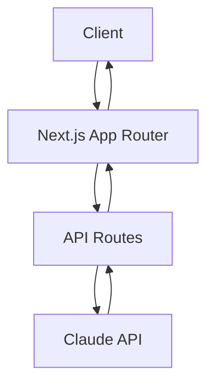

# ResumeGrader.AI 📝


ResumeGrader.AI is an intelligent resume analysis tool that helps job seekers optimize their resumes for specific job postings. Using Claude's advanced AI capabilities, it provides detailed feedback, matching scores, and actionable recommendations.

## Features ✨

- **Instant Resume Analysis**: Get immediate feedback on how well your resume matches a job posting
- **Smart Matching**: Advanced AI-powered analysis of skills, experience, and keywords
- **Detailed Recommendations**: Receive specific suggestions for improvement
- **User-Friendly Interface**: Clean, modern UI with both light and dark modes
- **Multiple Input Methods**: Support for both text paste and file upload
- **Secure Processing**: All analysis is performed server-side for data security

## Tech Stack 🛠️

- [Next.js 14](https://nextjs.org/) - React framework with App Router
- [TypeScript](https://www.typescriptlang.org/) - Type safety and developer experience
- [Tailwind CSS](https://tailwindcss.com/) - Utility-first CSS framework
- [Anthropic Claude API](https://www.anthropic.com/claude) - AI-powered analysis
- [TanStack Query](https://tanstack.com/query/latest) - Server state management
- [React](https://react.dev/) - UI components and interactivity

## Getting Started 🚀

### Prerequisites

- Node.js 18.17 or later
- An Anthropic API key

### Installation

1. Clone the repository:
```bash
git clone https://github.com/yourusername/resume-grader.git
cd resume-grader
```

2. Install dependencies:
```bash
npm install
```

3. Create a `.env.local` file in the root directory:
```env
ANTHROPIC_API_KEY=your_api_key_here
```

4. Run the development server:
```bash
npm run dev
```

Open [http://localhost:3000](http://localhost:3000) to view the application.

## Usage 💡

1. Paste or upload your resume
2. Paste or upload the job posting
3. Click "Evaluate" to receive:
   - Match percentage score
   - Matching skills analysis
   - Missing requirements identification
   - Detailed recommendations for improvement

## Architecture 🏗️

The project follows a modern Next.js architecture with:

- App Router for server-side rendering and API routes
- Server Components for improved performance
- API Routes for secure processing
- React Server Components for optimal client/server balance
- TanStack Query for efficient data fetching and caching



## Security 🔒

- API keys are securely stored server-side
- All API calls are proxied through Next.js API routes
- No sensitive information is exposed to the client
- Input sanitization and validation

## Contributing 🤝

Contributions are welcome! Please feel free to submit a Pull Request. For major changes, please open an issue first to discuss what you would like to change.

1. Fork the repository
2. Create your feature branch (`git checkout -b feature/AmazingFeature`)
3. Commit your changes (`git commit -m 'Add some AmazingFeature'`)
4. Push to the branch (`git push origin feature/AmazingFeature`)
5. Open a Pull Request

## License 📄

This project is licensed under the MIT License - see the [LICENSE](LICENSE) file for details.

---

<p align="center">
  Made with ❤️ by <a href="https://github.com/fantods">Matt Emmons</a>
</p>
